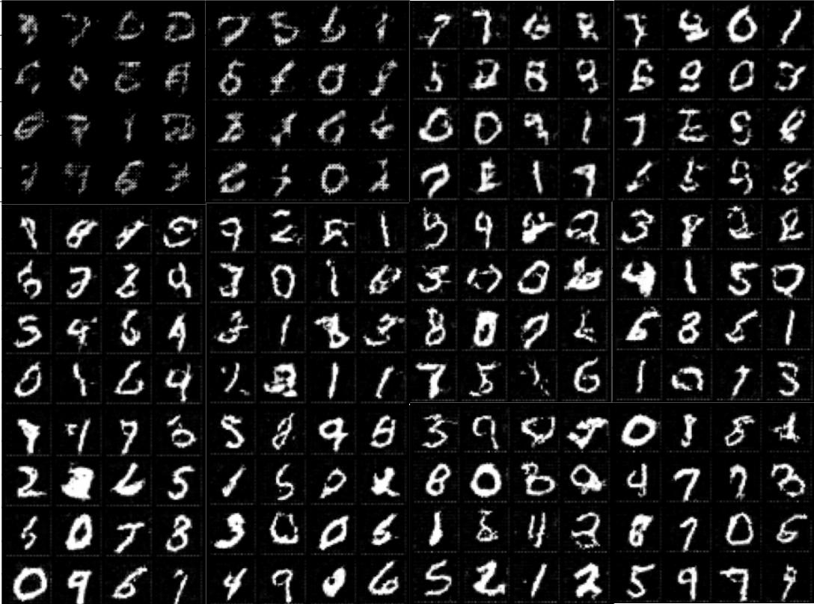
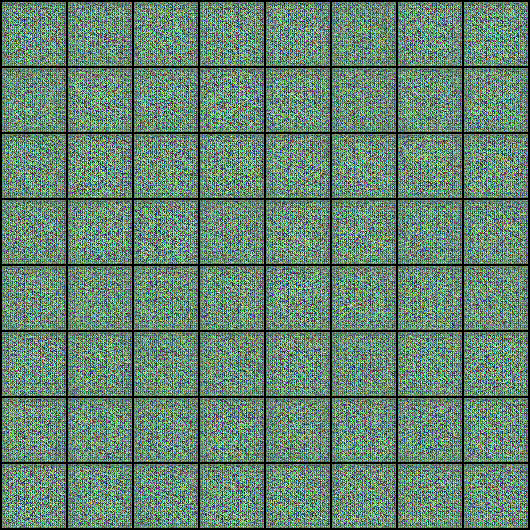

  
  <h1 align="center">Generative Adverserial Network Project</h1>

  
Table of Contents

  <ol>
    <li>
      <a href="#about-the-project">About The Project</a>
    </li>
    <li>
      <a href="#Phases">Phases</a>
      <ul>
        <li><a href="#Phase1">Impelent Model for MNIST dataset</a></li>
        <li><a href="#Phase2">Impelent Model for AnimeFace dataset</a></li>
      </ul>
    </li>
    <li><a href="#contact">Contact</a></li> 
  </ol>

## About The Project
This project implements `generative-adverserial neural networks` with `PyTorch` and uses the `MNIST` and `AnimeFace` dataset for a training and testing model. 

## Phases  

<h3 id="Phase1">Implement Model for MNIST dataset</h3>  

In this phase networks are designed for `MNIST` dataset. All further information about architecture of models and results are saved in the notebook.
an image which is created by results of generator network every epoch.  

<h3 id="Phase2">Implement Model for AnimeFace dataset</h3>  
  
In this phase networks are designed for `AnimeFace` dataset. All further information about architecture of models and results are saved in the notebook.  

a video which is created by results of generator network every epoch.  

## Contact
[Amirreza Naziri](https://github.com/Amir79Naziri)  
Email: naziriamirreza@gmail.com  

